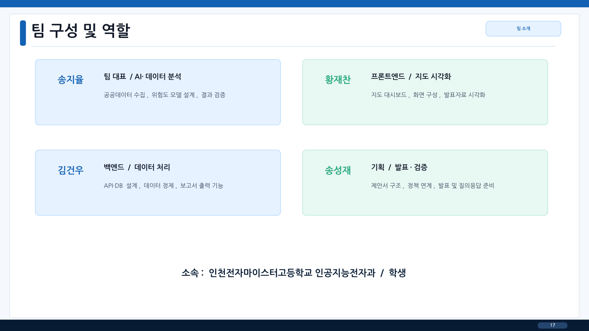

# 청주 안심동선 · 기존 공동 기획·설계 경험

2026 AI 도시·지역혁신 아이디어 공모전을 위해 구성한 설계 제안 자료입니다. 이번 AgentBridge와 다른 프로젝트이며, 참가자들의 이전 경험을 보여 주기 위해 수록했습니다.

## 문제와 제안

청주시 원도심 정비사업 주변에서 고령보행자가 마주치는 위험을 파악하고, 기존 CCTV·가로등·보행로를 어디부터 개선할지 제안하는 구조입니다.

사고·인구·시설·도로 자료를 100m 격자로 통합하고, 위험점수·원인·개선 후보·TOP 20 점검지점을 지도와 보고서로 연결하도록 설계했습니다. 가중치 기반 점수와 RandomForest/XGBoost 비교는 제안 및 후속 구현 계획에 해당합니다.

## 원본 제안서 17쪽의 개인 역할

| 팀원 | 담당 분야 | 기재된 담당 내용 |
|---|---|---|
| 송지율 | 팀 대표 / AI·데이터 분석 | 공공데이터 수집, 위험도 모델 설계, 결과 검증 |
| 황재찬 | 프론트엔드 / 지도 시각화 | 지도 대시보드, 화면 구성, 발표자료 시각화 |
| 김건우 | 백엔드 / 데이터 처리 | API·DB 설계, 데이터 정제, 보고서 출력 기능 |
| 송성재 | 기획 / 발표·검증 | 제안서 구조, 정책 연계, 발표 및 질의응답 준비 |

개인 담당은 위 역할표에 근거합니다. 모든 기능의 구현 완료 또는 특정 페이지의 개인 단독 저작을 입증하는 표는 아닙니다.

## 산출물과 범위

[원본 발췌 PDF](../evidence/cheongju/source-pages.pdf)는 원본 1·4·5·6·7·8·9·10·11·12·14·15·17쪽을 내용 수정 없이 모은 자료입니다. 원래 페이지 번호를 유지했습니다.

위험점수, 개선효과 점수와 예산 5,000만원은 모의 구성입니다. 실제 공개데이터 분석·API/DB 구축·지도 서비스 운영·정책 도입·사고 감소의 증빙으로 사용하지 않습니다. 확인되는 경험은 문제 정의, 설계 제안, 역할 분담과 문서 산출입니다.

